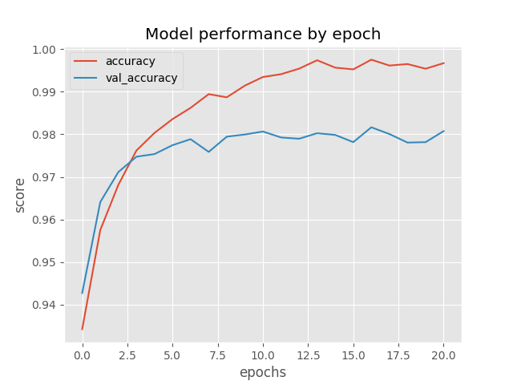

#  

A simple decorator that allows you to `fit` and `plot` your PyTorch model.

Requires `torch`, `tqdm` and `matplotlib`.

**This project is in early development. Brace yourselves, breaking changes are coming.**

## MNIST example
See `mnist_example.py` for the full example, but here are the essential parts:

```python
>>> from torchbase import magic
>>> 
>>> @magic('categorical_cross_entropy', metrics = 'accuracy_with_logits')
... class Net(torch.nn.Module):
...   def __init__(self):
...     super().__init__()
...     self.fc = torch.nn.Linear(28 * 28, 100)
...     self.out = torch.nn.Linear(100, 10)
... 
...   def forward(self, x):
...     x = torch.flatten(x, start_dim = 1)
...     x = torch.nn.functional.gelu(self.fc(x))
...     return self.out(x)
... 
>>> # Get preprocessed MNIST data
>>> train_dl, val_dl = get_mnist_dataloaders()
>>> 
>>> net = Net()
>>> net.fit(train_dl, val_dl)
Epoch  0 - loss 0.1930 - accuracy 0.9342 - val_loss 0.1638 - val_accuracy 0.9427: 100%|███████████████████████████████| 60000/60000 [00:08<00:00, 6695.25it/s]
(...)
Epoch 20 - loss 0.0090 - accuracy 0.9967 - val_loss 0.0879 - val_accuracy 0.9808: 100%|███████████████████████████████| 60000/60000 [00:08<00:00, 6921.11it/s]
>>> net.plot(['accuracy', 'val_accuracy'])
```

